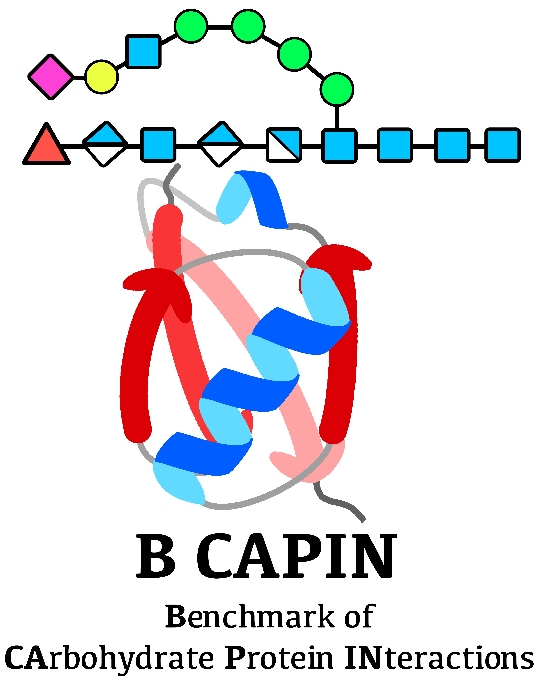

# BCAPIN #



Official repository for Benchmark of CArbohydrate Protein INteractions:  
[`Evaluation of De Novo Deep Learning Models on the Protein-Sugar Interactome`](https://doi.org/10.1101/2025.09.02.673778)

<details><summary><b>Citation</b></summary>
Evaluation of De Novo Deep Learning Models on the Protein-Sugar Interactome
Samuel W Canner, Lei Lu, Sho S Takeshita, Jeffrey J Gray

bioRxiv 2025.09.02.673778; doi: https://doi.org/10.1101/2025.09.02.673778
</details>

## Predicted structure Data

All generated structural data is available at `./bcapin_all_data.zip`

All data for DockQC is provided in `dockqc_results.tsv`

## DockQC Installation

### Local Install
```
conda env create -f bcapin.yml
conda activate bcapin
```

# How to run: Command Line #

```
python dockqc.py -x path/to/exp_file.pdb -p path/to/pred_file.pdb -xp A -xc B -pp A -pc B
```

### Help info ###
```
-x experimentally solved structure
-p predicted get_structure
-xp protein chain in experimentally solved structure (comma seperated)
-xc carbohydrate chain in experimentally solved structure (comma seperated)
-pp protein chain in predicted structure (comma seperated)
-pc carbohydrate chain in predicted structure (comma seperated)
```

### Example input ###
For `7EQR` example case provided here

```
python dockqc.py -x ./ex/7eqr_wt.pdb -p ./ex/7eqr_af.pdb -xp B -xc H -pp A -pc B
```

Expected result: `0.402`


For `7RFT` example case provided here

```
python dockqc.py -x ./ex/7rft_wt.pdb -p ./ex/7rft_boltz0.cif -xc C
```

Expected result: `0.486`


For `7W11` example case (multiple carb chains!!!):

```
python dockqc.py -x ./ex/7w11_wt.pdb -p ./ex/7w11_chai.cif -xc B,C -pc B,C
```

Expected result: `0.722`
